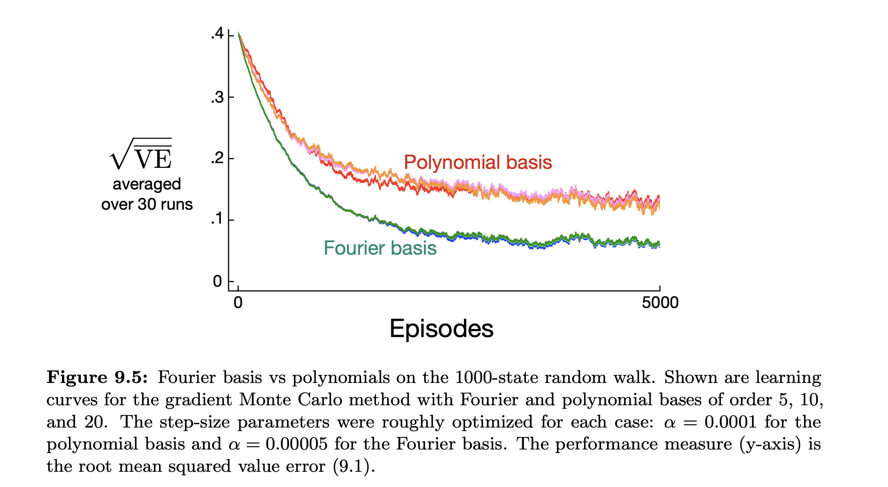
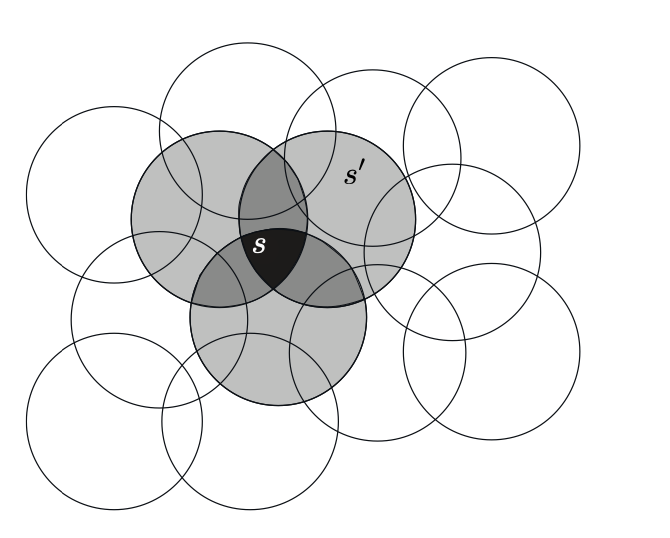

# Background 

## Introduction
In this section, we will go over the theoretical background necessary (and undone by me previously) to be able to implement the algrotithms of the assingment. I will essentially be writing about parts of chapter 9 (On policy prediction with Approximation) from the Sutton and Barto book. 

## On Policy Prediction and Approximation

A shift in the perspective is to stop represention function approximations by tables and start considering parametrized functions themselves to approximate the value function. This may very well be a neural network. 
Typcially, the number of weights is much lesser than the number of states (side note: thus superposition is inevtiable), and consequently when a single state is updated, then change generalizes from that state ot multiple other states (this is one of the points that makes it different from tabular representation). This generalization makes learning more powerful as well as harder to manage. Extending reinforcement learning to function approximation also makes it applicable to partially observable problems. A limitation is that the method cannot augment the state representation with memories of past observation. 

One can see from the arguments above why it is preferred, and in a way natural, to use these methods for continuous frameworks. 

## The Preditction Objective

We are obligated to say which states we care about the most due to the nature of a "butterfly effect" mentioned above. We essentially need to assign a probability measure to the state space, and then take the Mean Squared Value Error, denoted $\overline{VE}$: 

$$
\overline{VE}(\mathbf{w}) = \sum_{s \in S}\mu(s)[v_{\pi}(s) - \hat{v}(s, \mathbf{w})]^2
$$

The square root of the error is often what is used in the plots, and the measure function is ussually chosen to be the fraction of time you spend at that state. Under on-policy training, this is called the *on policy distribution*. In continuing tasks, it is the stationary distribution under $\pi$. In formal analysis, continuing and episodic tasks must be treated differently. For episodic, you solve it recursively. 

## Stochastic Gradient and Semi Gradient Methods

SGD is particularly well suited for online reinforcement learning. But the resources are limited so we need to make assumptions. We assume that states appear in examples with the same distribution $\mu$, over which we are trying to minimize the $\overline{VE}$. A good strategy is to minimize error on observed examples:

$$
\mathbf{w_{t+1}} = \mathbf{w_t} - \frac{1}{2}\alpha\nabla[v_{\pi}(S_t) - \hat{v}(S_t, \mathbf{w_t})]^2 = \mathbf{w_t} + \alpha[v_{\pi}(S_t) - \hat{v}(S_t, \mathbf{w_t})]\nabla\hat{v}(S_t, \mathbf{w_t})
$$

For convergence, $\alpha$ must decrease nicely. But we may not know $v_{\pi}(S_t)$, so replace it by the estimate $U_t$ in the equation if the value is not known. 

At this point, it is good to review the equation (replaced with $U_t$). Our SGD is just going to approximate to that $U$, why even do it in the first place? The answer is that if we use the $U$ estimate directly, we are not generalizing properly. We want to approximate an entire function across multiple states, thus it makes sense to only move in the direction of it by a certain distance, not go the whole way at once. 

If your estimate $U_t$ is unbiased, then it is guaranteed for the algorithm to converge to a local optimal value. For example, the Monte Carlo State Value prediction. However, boot strapping methods are not guaranteed to converge. Thus they consider the target independent of the weights in our derivation for convergence, and are accordingly called semi-gradient method. Although their convergence is not robust, they converge reliably in the linear case. They are in fact preferred due to their faster convergence. A prototypical example of such a method is smei gradient $TD(0)$. 

## Linear Methods 

These are special cases of function approximation in which the approximate function is a linear function of the weight vector $\mathbf{w}$. Consider the vector on a state $\mathbf{x}$, then the linear approximate function $\hat{v}$, is $\hat{v}(s, \mathbf{w}) = w^T\mathbf{x}(s)$ (which is the inner product). In this case, the value approximate function is linear in the weights, or simply linear. The vector $x(s)$ is called a feature vector representing state $s$, each component of which maps the state to a real number. 

Essentially, we have many features associated with a state, which is what the feature vector captures. The coordinate functions of $\mathbf{x}$ are formally called features as well. For linear methods, features are basis functions because they form a linear basis for the set of approximate functions.

It is natural to use SGD updates with the linear function approximation. In our case, $\nabla\hat{v}(s, \mathbf{w}) = \mathbf{x}(s)$. Thus the equation is particularly simple: 
$$
 \mathbf{w_{t+1}} = \mathbf{w_t} + \alpha[U_t - \hat{v}(S_t, \mathbf{w_t})]\mathbf{x}(S_t)
$$

In the linear case (except in the degenerate case) the global optimum is unique (calculate the hessian matrix if you wish to check). 

Monte Carlo method converges under the linear approximation to the global optima if $\alpha$ decreases over time, and $TD(0)$ converges as well, not necessarily the global optima though. It will be a good exercise to do so. 

$$
\mathbf{w}_{t+1} = \mathbf{w_t} + \alpha(R_{t+1} + \gamma\mathbf{w}_t^T\mathbf{x_{t+1}} - \mathbf{w}_t^T\mathbf{x}_t)\mathbf{x}_t
$$

$$
\iff \mathbf{w_{t+1} = \mathbf{w}_t + \alpha(R_{t+1}\mathbf{x}_t + \gamma<w_t, x_{t+1} - x_t>x_t)}
$$

$$ \iff \mathbf{w}_{t+1} = \mathbf{w}_t + \alpha(R_{t+1}\mathbf{x}_t - \mathbf{x}_t(\mathbf{x}_t - \gamma\mathbf{x}_{t+1})^T\mathbf{w}_t)
$$

Above, $\mathbf{x}_t = \mathbf{x}(S_t)$. Once the system has reached a steady state, we can make inferences by considering: 

$$
\mathbb{E}[\mathbf{w}_{t+1} | \mathbf{w_t}] = \mathbf{w}_t + \alpha(\mathbf{b} - \mathbf{A}\mathbf{w}_{t})
$$
Where by substitution, $\mathbf{b} \in \mathbb{R}^d$ and $\mathbf{A} \in \mathbb{R}^{d}\times \mathbb{R}^d$. 

When the system converges, the second term must be zero. Hence,

$$
\mathbf{b} = \mathbf{A}\mathbf{w}_{TD} \implies \mathbf{w}_{TD} = \mathbf{A}^{-1}\mathbf{b}
$$

where $TD$ is called the fixed point. It can be proved that the semi linear $TD(0)$ converges to this point. One just needs to observe that the matrix $\mathbf{A}$ is positive definite, hence it is invertible and rewriting, one also finds that it converges well by some manipulations. 

Analysing the error at $TD$ with the lowest possible error, it is found that there is often substantial potential loss. But $TD$ methods have vastly reduced variance compared to Monte Carlo Methods, and thus, their convergence is faster. One eventually decides which method to choose based on the problem and its requirements. 

## Feature Construction for Linear Methods

Choosing features appropriate to the task is an important way of adding prior domain knowledge to Reinforcement Learning Systems. Intuitively, the features should correspond to the aspects of the state space along which generalization may be appropriate (notice that the gradient updates the values along the coordinates of $\mathbf{x}$). A limitation of the linear form is that it cannot account for interaction between the features. Hence the linear value function would need features for combinations of the underlying state dimensions. 

### Polynomials

Polynomial features are one kind, which work in reinforcement learning problems similar to regression and interpolation. 

Suppose each state $s$ corresponds to $k$ numbers $\{s_1, s_2, ..., s_k\}$ with each $s_i \in \mathbb{R}$. For this $k$ dimensional space, each order $n$- polynomial basis feature $x_i$ can be written as 

$$
x_i(s) = \prod_{j=1}^{k}s_j^{c_{i, j}}
$$

where each $c_{i, j}$ is an integer in the set $\{0, 1, ..., n\}$ for an integer $n \geq 0$. These features make up the order-$n$ polynomial basis for dimension $k$, which contains $(n + 1)^k$ different features. 

Since there are exponentially many features, one needs to choose a subset of them for the function approximation, and this can be done through prior beliefs, and some variants of the automated selection methods developed for classical polynomial regression. 

### Fourier Basis

Fourier basis functions are of interest because they are easy to use and can perform well on a range of reinforcement learning problems. 

Suppose each state $s$ corresponds to a vector of $k$ numbers, $\mathbf{s} = (s_1, ..., s_k)^T$ with each $s_i \in [0, 1]$ (normalize the state space). The $i$-th feature of the fourier cosine basis can then be written as 

$$
x_{i}(s) = \cos(\pi \mathbb{s}^T\mathbf{c}^i)
$$

where $\mathbf{c}^i = (c_1^i, ..., c_k^i)^T$ with each $c_j^i \in \{0, 1, ..., n\}$
Here, $i$ ranges from $0$ to $(n+1)^k$. This means there are that many possibilities. $n$ is the order of approximation that we choose. 

It is better to use cosine instead of sin since the former is continuous at 0, unlike the latter. 

The curse of dimensionality follows here as well, but if the dimension is less, then the selection of features almost becomes automatic. 

(Fourier basis is always recommended compared to polynomial basis in online RL)
(Reference: Sutton and Barto)

### Coarse Coding

A kind of representation for a continuous two dimensional state space is through features corresponding to circles on the state space. If a state is in a circle, then the corresponding feature has the value $1$ at that state, and is said to be present, else it has the value $0$ and is said to be absent. This kind of 1-0 valued feature is called a *binary feature* (Thus features are really indicator variables of circles). Representing a state with features that overlap in this way (although the shapes need not be circles and the values not binary) is called *coarse coding*. 

Assuming linear gradient descent function approximation, each circle corresponds to a weight (a component of the weight vector). If we train at one state, a point in the space, then the weights of all the intersecting circles will also be affected. 

(Reference: Sutton and Barto)

Thus if the circles are shorter, the generalization will be narrower, whereas if they are large, the generalization will be broarder. Moreover, the shape of the features will determine the nature of the generalzation. 

It may be thought that broad generalization in this case also comes with coarse approximation. However, that is not the case. The finest discrimination possible between the features is controlled more by the number of features. 

### Tile Coding 

Tile coding is a form of coarse coding for multidimensional continuous spaces that is flexible and computationally efficient. It is a very practical feature representation for modern sequential digital computers. 

In tile coding, the receptive fields of the features are grouped into partitions of the space. Each such partition is called tiling (so it is just like state aggregation), and each element of the partition is called a tile. Thus, generalization spreads to a tile. To generalize better, we use overlapping receptive fields. With this, a single state may be in multiple tilings. In the case of multiple tilings, each tiling is offset by a small amount. Also, now, multiple features finally correspond to a single state, giving the power of coarse coding. 

An immediate advantage of tile coding is that the number of features present is the same as the number of tiles. This allows the step size parameter $\alpha$ to be set easily, $\alpha = O(\frac{1}{n})$, where $n$ is the number of tilings. 

There is also computational advantages from its use of binary feature vectors. 

Assymetrical offsetting is preferred in tile coding for uniform generalization. The offset is represented by a displacement vector. The magnitude is generally uniform itself, given by a ratio of width and number of tilings in the case of rectangular tiles.

Different displacement vectors can be chosen. For example, those along the diagonal stripe will favor generalization in that direction. 

Another useful trick for reducing memory requirements is hashing - a consistent pseudo-random collapsing of a large tiling into a much smaller set of tiles. Hasing produces tiles consisting of noncontiguous, disjoint regoins randomly spread throughout the state space, but that still form an exhaustive partition. The loss of performance is little. 

### Radial Basis Functions 

Radial Basis functions approximate multivariate functions. 

Mathematically speaking, a radial function is $\psi(x) = \hat{\psi}(||x||)$, and this collection typically forms an actual basis of the function space. 

Raidal Basis Functions are the natural generalization of coarse coding to continuous valued features. Now, instead of a feature taking the binary values, it can take values in $[0, 1]$. A typical RBF feature $x_i$ has a Gaussian response $x_i(s)$ dependent only on the distance between the state $s$ and the feature's prototypical or centre state $c_i$, and relative to the feature's width $\sigma_i$:

$$
x_i(s) = \exp(- \frac{||s - c_i||^2}{2\sigma_i^2})
$$

where the norm may be chosen depending on the situation. 

The primary advantage of RBFs over binary features is that they produce approximate functions that are smooth and differentiable. 

### Questions to ask

1) Is there a point to any of this, when neural networks exist? What is there to learn from this. 

2) Need to understand hashing better in this context. 

